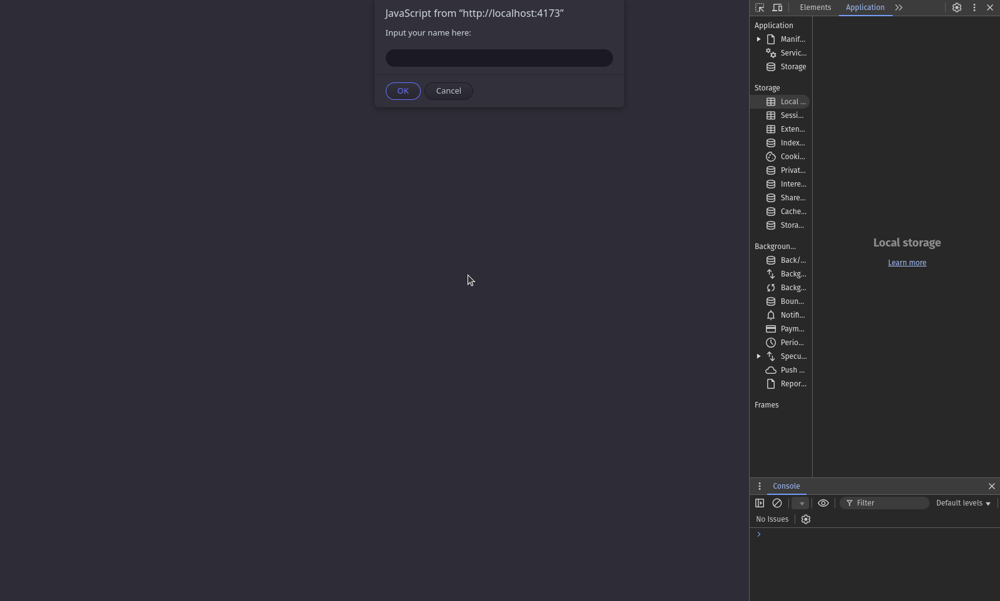
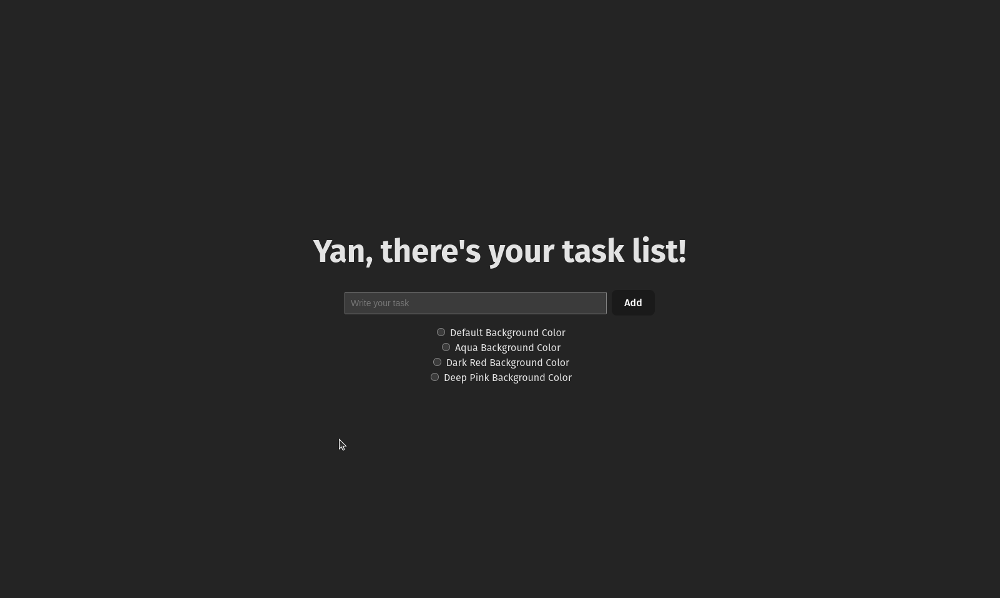
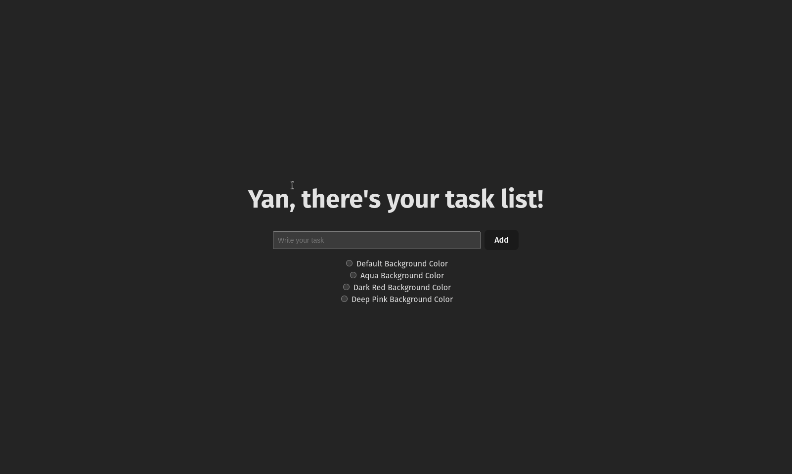

# Web Development Exercise (PDF 2)
A project focused to complete Web Development's exercises of React, training and substantiating React fundamentals.

# Description
It consists in a Basic SPA (Single Page Application) that includes:
- Prompt your name and save it in your local storage.



- Track tasks by user text input.



- Change background color by radio buttons.



# Installation
> Node version >= 20.1 and npm version >= 8.19.4 required

```sh
$ npm install
```

# Usage
It's possible to use the project in development environment and production environment.

**Development:**
```sh
$ npm run dev
```

It you run the project in localhost with port **5173**.

**Production:**
```sh
$ npm run build && npm run preview
```

It you run the project in localhost with port **4173**.